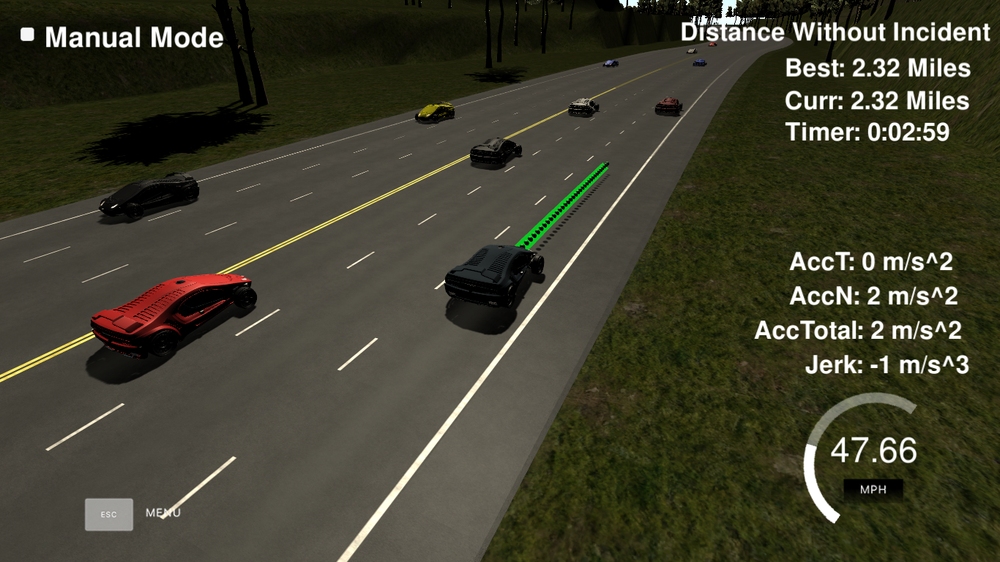

# Path Planning



### Goal
The goal of this project is to safely navigate around a virtual highway with other traffic that is driving +-10 MPH of the 50 MPH speed limit using the car's localization and sensor fusion data as well as a sparse map list of waypoints around the highway.

The car should try to go as close as possible to the 50 MPH speed limit, which means passing slower traffic when possible. The car should avoid hitting other cars at all cost as well as driving inside of the marked road lanes at all times, unless going from one lane to another. Also the car should not experience total acceleration over 10 m/s^2 and jerk that is greater than 10 m/s^3.

#### Contents

* [Prediction](#prediction)
* [Behavioral Planning](#behavioral-planning)
* [Trajectory Generation](#trajectory-generation)

---

### Simulator
This project involves [this simulator](https://github.com/udacity/self-driving-car-sim/releases/tag/T3_v1.2).

To run the simulator on Mac/Linux, first make the binary file executable with the following command:
```shell
sudo chmod u+x {simulator_file_name}
```

### Basic Build Instructions

1. Clone this repo.
2. Make a build directory: `mkdir build && cd build`
3. Compile: `cmake .. && make`
4. Run it: `./path_planning`.

### Dependencies

* cmake >= 3.5
  * All OSes: [click here for installation instructions](https://cmake.org/install/)
* make >= 4.1
  * Linux: make is installed by default on most Linux distros
  * Mac: [install Xcode command line tools to get make](https://developer.apple.com/xcode/features/)
  * Windows: [Click here for installation instructions](http://gnuwin32.sourceforge.net/packages/make.htm)
* gcc/g++ >= 5.4
  * Linux: gcc / g++ is installed by default on most Linux distros
  * Mac: same deal as make - [install Xcode command line tools]((https://developer.apple.com/xcode/features/)
  * Windows: recommend using [MinGW](http://www.mingw.org/)
* [uWebSockets](https://github.com/uWebSockets/uWebSockets)
  * Run either `install-mac.sh` or `install-ubuntu.sh`.
  * If you install from source, checkout to commit `e94b6e1`, i.e.
    ```
    git clone https://github.com/uWebSockets/uWebSockets
    cd uWebSockets
    git checkout e94b6e1
    ```
---

## Prediction

The code in `./src/main.cpp` generates a new path for the car to follow before it is executed by the simulator. Each generated path makes use of some points from the last path to obtain a smooth transition and trajectory from one path to another. I generate 45 points at each cycle where 5 points belong to the last path and 40 new points are added.

Due to this time difference between path generation and execution, we need to predict the ego vehicle as well as other vehicles position at the end of the last path, estimating the new position using the sensor fusion data and each vehicle's velocity.

#### Cruise Control

The car is driving in its lane at the speed limit if it has no cars in front of it. When a car is detected, the vehicle adapts its velocity accordingly to the car in front and follows the vehicle with the same velocity.

## Behavioral Planning

The decisions made by the ego vehicle are mainly focused on each lane's velocity so that it always drives on the highest velocity lane and reaches the goal in the shortest time possible.

#### Finite State Machine

A finite state machine is used for handling lane changes. The states are:

* **Keep Lane** `KL`: the car drives in its lane following the reference velocity.

* **Prepare Lane Change to the Left** `PLCL`: the car checks if a left lane change is possible.

* **Prepare Lane Change to the Right** `PLCR`: the car checks if a right lane change is possible.

* **Lane Change to the Left** `LCL`: the car executes a lane change to the left.

* **Lane Change to the Right** `LCR`: the car executes a lane change to the right.


* From *Keep Lane*, my car basically changes to `PLCL` if the best lane is on the left, `PLCR` if it is on the right or keeps its lane if it's already driving on the best lane.

* From *Prepare Lane Change to the Left* & *Prepare Lane Change to the Right*, the vehicle adapts its velocity to the desired lane and only goes to the next state (`LCL` or `LCR`) if the desired lane is not occupied inside a predefined zone near the ego car.

  If some time has passed without changing lanes, the lane change is aborted and it returns to the `KL` state.

* From *Lane Change to the Left* & *Lane Change to the Right*, the car just changes lanes and return to `KL`.

## Trajectory Generation

The desired speed of the car at each cycle is set depending on the distance between the generated points.

In order to avoid big changes in acceleration, I set each cycle's velocity as a slightly increment/decrement from last cycle velocity depending on my current reference velocity and the distance to the vehicle ahead (if it is the case). Then, I set the distance increment between points after calculating the velocity.


For generating the new points, I sample with the calculated distance increment from a spline (http://kluge.in-chemnitz.de/opensource/spline/) that contains the last two points and three new waypoints.

This way, we can obtain a smooth trajectory for the vehicle to follow.

### Final result

Here's a short [video of my final result](./media/vid.mp4) where the car is driving around the highway.
